Now that we have our library installed, we can get started playing around with our examples to learn more about how the IMU behaves. From there we'll be able to build our own custom code to integrate the sensor into a project.

!!! note
    As of Arduino Library v1.0.3, the following line of code has been included for microcontrollers with built-in native USB (i.e. the SAMD51). This can be commented out when using the BNO086 in projects that are not using a Serial Terminal.

    <pre><code class="language-c">while(!Serial) delay(10); // Wait for Serial to become available.
    // Necessary for boards with native USB (like the SAMD51 Thing+).
    // For a final version of a project that does not need serial debug (or a USB cable plugged in),
    // Comment out this while loop, or it will prevent the remaining code from running.</code></pre>

### Example 1 - Rotation Vector

This first example gets us started taking a reading of our [complex valued rotation vector, or quaternion,](https://en.wikipedia.org/wiki/Quaternions_and_spatial_rotation) which tells us how we are oriented. Open the example by navigating to **File** > **Examples** > **SparkFun BNO08X Cortex Based IMU** > **Example_01_RotationVector**.

Select your board in the Tools menu (in our case **SparkFun ESP32 IoT RedBoard**) and the correct Port it enumerated on and click "Upload". After uploading the code, open the [Serial Monitor](https://learn.sparkfun.com/tutorials/terminal-basics) or terminal emulator of your choice with the baud rate set to **115200**.

You should see an output of the quaternion values (i.e. i, j, k, and real) and the accuracy in radians.

  <table>
    <tr style="vertical-align:middle;">
     <td style="text-align: center; vertical-align: middle;"><a href="../assets/img/VR_IMU-BNO086_Arduino_Ex1_Rotation_Vector.JPG">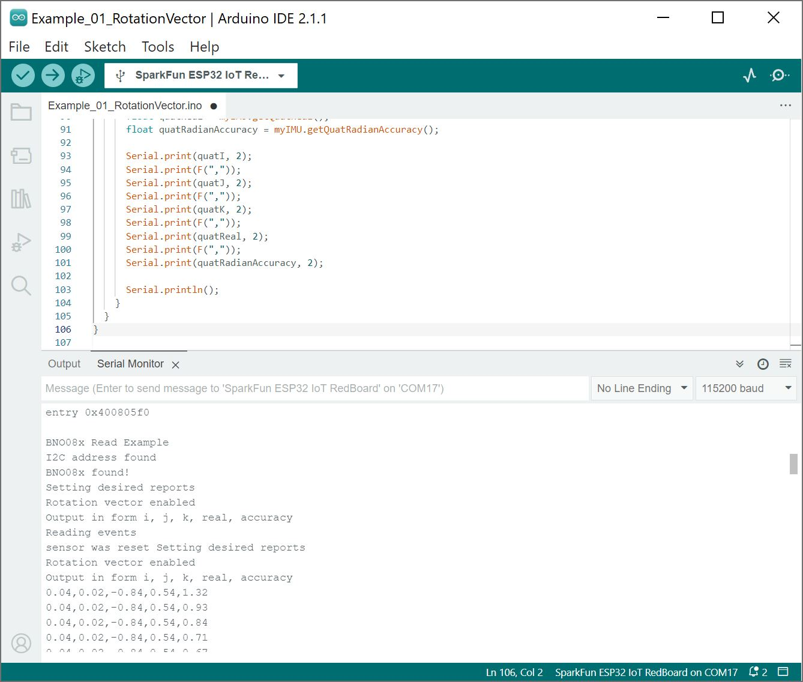</a></td>
    </tr>
  </table>

  <i>Having a hard time seeing output? Click on the image for a closer look.</i>

### Example 2 - Accelerometer

Examples 2 deals with pulling the accelerometer values from our sensor to figure out how it is moving. Open the example by navigating to **File** > **Examples** > **SparkFun BNO08X Cortex Based IMU** > **Example_02_Accelerometer**.

Select your board in the Tools menu (in our case **SparkFun ESP32 IoT RedBoard**) and the correct Port it enumerated on and click "Upload". After uploading the code, open the [Serial Monitor](https://learn.sparkfun.com/tutorials/terminal-basics) or terminal emulator of your choice with the baud rate set to **115200**.

You should see an output of the accelerometer values for x, y, and z in m/s2. If the breakout board is on the table with the z-axis pointed up to the ceiling, you should see a value close to the value of about +9.81 m/s. Of course, that value can vary depending on where you are on Earth](https://en.wikipedia.org/wiki/Gravity_of_Earth) or if the board is not fully rested on a flat table.

  <table>
    <tr style="vertical-align:middle;">
     <td style="text-align: center; vertical-align: middle;"><a href="../assets/img/VR_IMU-BNO086_Arduino_Ex2_Accelerometer_Gravity.JPG">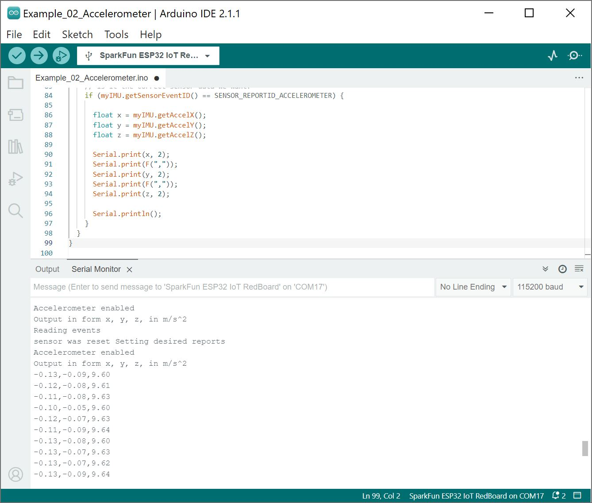</a></td>
    </tr>
  </table>

  <i>Having a hard time seeing output? Click on the image for a closer look.</i>

### Example 3 - Gyro

In example 3, we'll pull values from the IMU's gyroscope to get a vector for our angular velocity. Open the example by navigating to **File** > **Examples** > **SparkFun BNO08X Cortex Based IMU** > **Example_03_Gyro**.

Select your board in the Tools menu (in our case **SparkFun ESP32 IoT RedBoard**) and the correct Port it enumerated on and click "Upload". After uploading the code, open the [Serial Monitor](https://learn.sparkfun.com/tutorials/terminal-basics) or terminal emulator of your choice with the baud rate set to **115200**.

You should see the angular velocity for x, y, and z in radians/s. Try rotating the board about each axis. You should see the values change depending on the direction that you rotate the board.

  <table>
    <tr style="vertical-align:middle;">
     <td style="text-align: center; vertical-align: middle;"><a href="../assets/img/VR_IMU-BNO086_Arduino_Ex3_Gyro.JPG">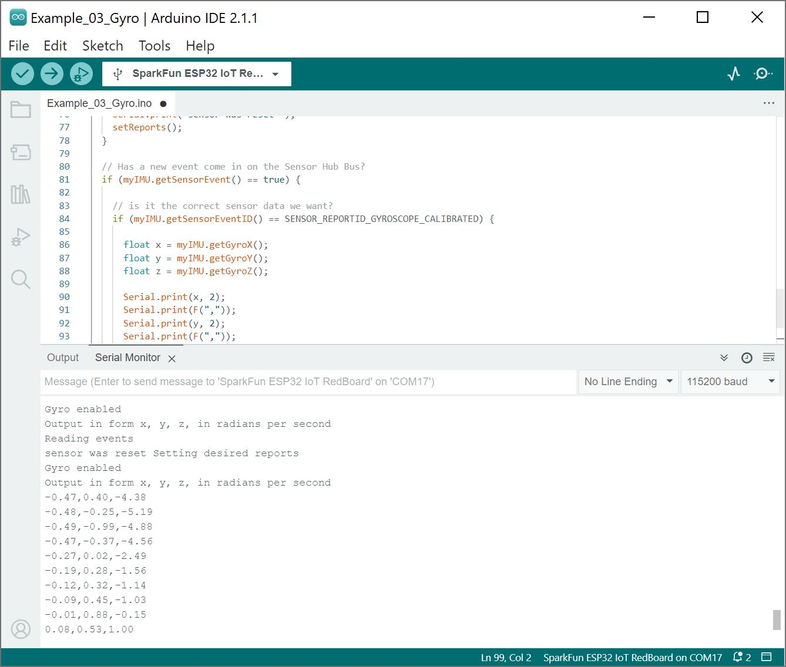</a></td>
    </tr>
  </table>

Also, check out the values in a graph by opening the Serial Plotter to the same baud rate to see the readings from each gyroscope channel plotted against each other. Rotate the IMU and see how the values respond, I got the following output just letting the IMU swing on its cable.

  <table>
    <tr style="vertical-align:middle;">
     <td style="text-align: center; vertical-align: middle;"><a href="../assets/img/VR_IMU-BNO086_Arduino_Ex3_Gyro_Serial_Plotter_Output.JPG">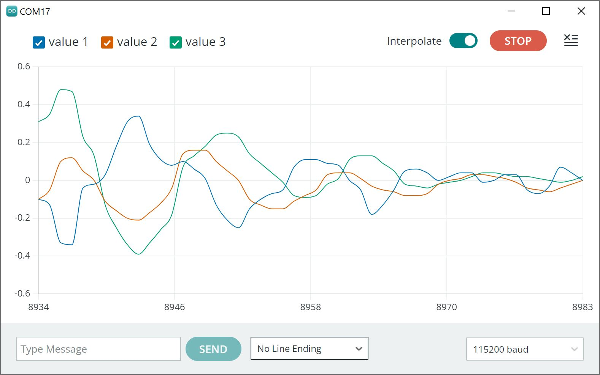</a></td>
    </tr>
  </table>

!!!note
    The range for the Arduino Serial Plotter along x-axis is a bit limited in Arduino IDE v2+ as opposed to previous versions like Arduino v1.8.19. There is a [feature request relating to the Arduino Serial Plotter in the GitHub repo for the Arduino IDE](https://github.com/arduino/arduino-ide/issues/803). If you would like a bigger range, try opening the Arduino Serial Plotter in an older Arduino IDE like Arduino v1.8.19. Just make sure to adjust the baud rate to 115200.

    

      <table>
        <tr style="vertical-align:middle;">
         <td style="text-align: center; vertical-align: middle;"><a href="../assets/img/VR_IMU-BNO086_Arduino_Ex3_Gyro_Serial_Plotter_Output_Older_Arduino_IDE_v1p8p19.JPG">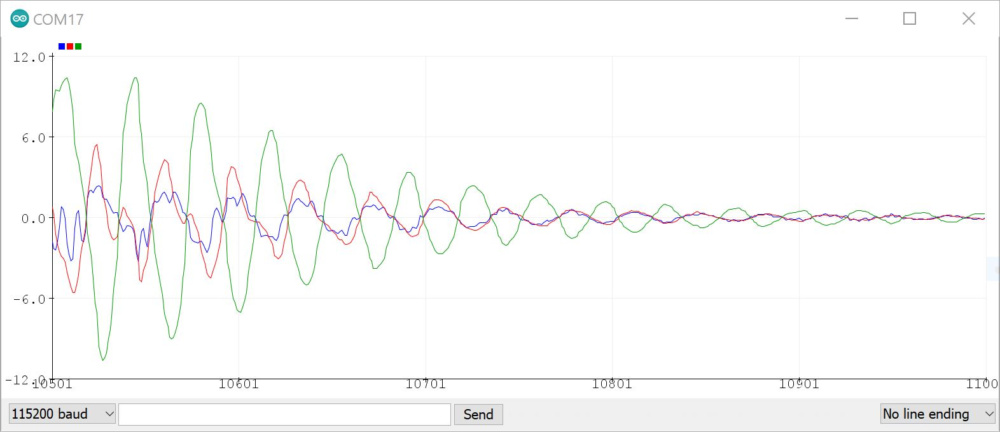</a></td>
        </tr>
      </table>
    

### Example 4 - Magnetometer

The following example will get us reading the component vectors for the magnetic field. Open the example by navigating to **File** > **Examples** > **SparkFun BNO08X Cortex Based IMU** > **Example_04_Magnetometer**.

Select your board in the Tools menu (in our case **SparkFun ESP32 IoT RedBoard**) and the correct Port it enumerated on and click "Upload". After uploading the code, open the [Serial Monitor](https://learn.sparkfun.com/tutorials/terminal-basics) or terminal emulator of your choice with the baud rate set to **115200**.

You should see the magnetometer values for x, y, and z in &micro;Tesla and the accuracy. Try moving the magnetometer around aligning the sensor with the North Pole. You can also try placing a weak magnet near the sensor to see the values increase. In this case, I placed a weak magnet which increased the magnitude of the field along the z-axis.

  <table>
    <tr style="vertical-align:middle;">
     <td style="text-align: center; vertical-align: middle;"><a href="../assets/img/VR_IMU-BNO086_Arduino_Ex4_Magnetometer.JPG">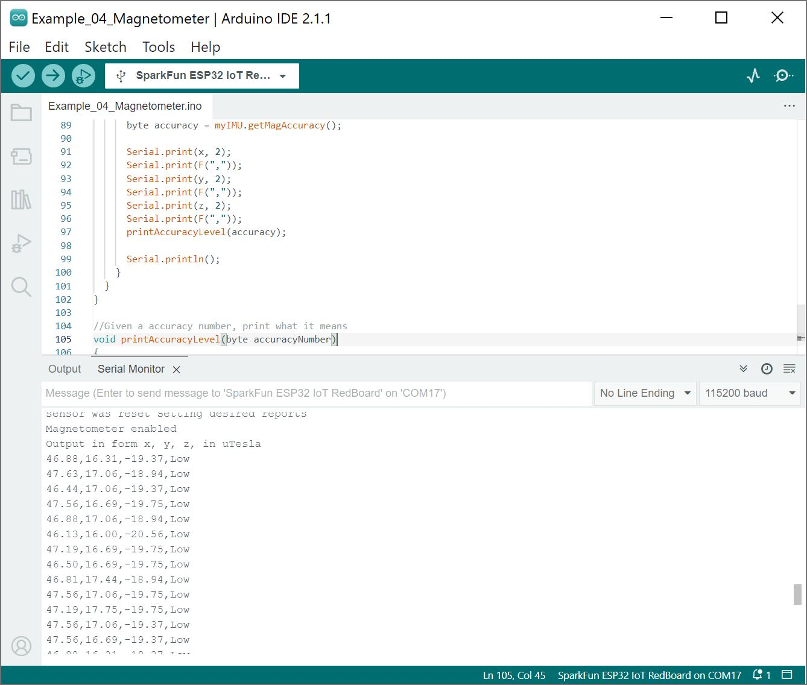</a></td>
    </tr>
  </table>

  <i>Having a hard time seeing output? Click on the image for a closer look.</i>

!!!warning
    Note that you will want to be careful about placing the sensor too close to a magnet (especially a strong magnet) as this can potentially damage the sensor.

### Example 5 - Step Counter

The BNO080 has some really neat built-in features due to its built in Cortex. One of these is a built in step counter. Open the example by navigating to **File** > **Examples** > **SparkFun BNO08X Cortex Based IMU** > **Example_05_StepCounter**.

Select your board in the Tools menu (in our case **SparkFun ESP32 IoT RedBoard**) and the correct Port it enumerated on and click "Upload". After uploading the code, open the [Serial Monitor](https://learn.sparkfun.com/tutorials/terminal-basics) or terminal emulator of your choice with the baud rate set to **115200**.

Try holding the sensor or attaching to your body while connect to a laptop and walk around. You should see a value close to the number of steps that you have taken. In this case, I just walked away from my table and back.

  <table>
    <tr style="vertical-align:middle;">
     <td style="text-align: center; vertical-align: middle;"><a href="../assets/img/VR_IMU-BNO086_Arduino_Ex5_StepCounter.JPG">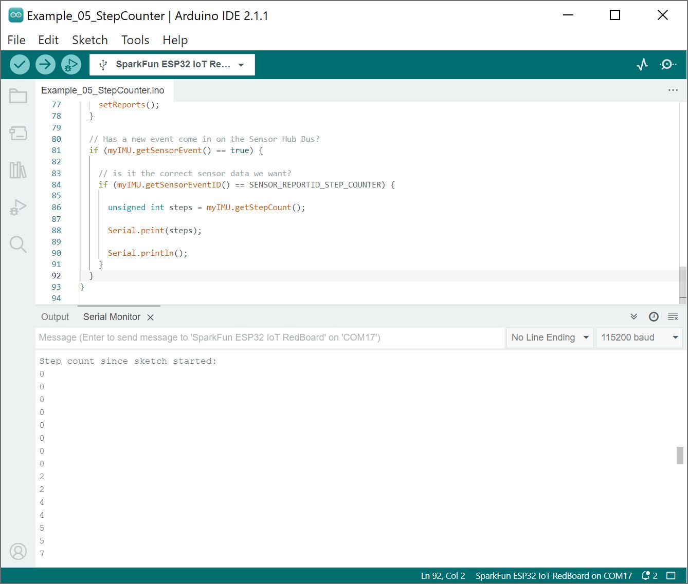</a></td>
    </tr>
  </table>

  <i>Having a hard time seeing output? Click on the image for a closer look.</i>

### Example 6 - Stability Classifier

This example sketch allows us to use the built-in stability classifier to figure out how stable the IMU is. Open the example by navigating to **File** > **Examples** > **SparkFun BNO08X Cortex Based IMU** > **Example_06-StabilityClassifier**.

Select your board in the Tools menu (in our case **SparkFun ESP32 IoT RedBoard**) and the correct Port it enumerated on and click "Upload". After uploading the code, open the [Serial Monitor](https://learn.sparkfun.com/tutorials/terminal-basics) or terminal emulator of your choice with the baud rate set to **115200**.

Give the BNO086 a second to measure and process the sensor values. The sensor will provide an output classifying an activity. In the output below, the sensor determined that the board was resting on a table... which it was! Amazing!

  <table>
    <tr style="vertical-align:middle;">
     <td style="text-align: center; vertical-align: middle;"><a href="../assets/img/VR_IMU-BNO086_Arduino_Ex6_StabilityClassifier.JPG">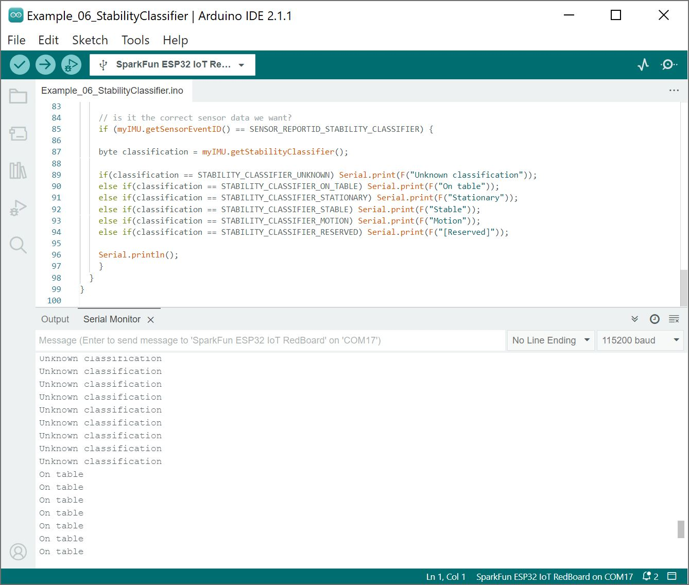</a></td>
    </tr>
  </table>

  <i>Having a hard time seeing output? Click on the image for a closer look.</i>

As stated in the datasheet, the sensor uses both the accelerometer and gyroscope to determine the sensor's stability: on table, stationary, stable, motion. If the sensor does not know what is happening, the output will tell you that it was an "unknown classification."

### Example 7 - Activity Classifier

The activity classifier is somewhat similar to the stability classifier in that it uses the on-board Cortex to determine what activity the IMU is doing. Open the example by navigating to **File** > **Examples** > **SparkFun BNO08X Cortex Based IMU** > **Example_07_ActivityClassifier**.

Select your board in the Tools menu (in our case **SparkFun ESP32 IoT RedBoard**) and the correct Port it enumerated on and click "Upload". After uploading the code, open the [Serial Monitor](https://learn.sparkfun.com/tutorials/terminal-basics) or terminal emulator of your choice with the baud rate set to **115200**.

Give the BNO086 a second to measure and process the sensor values. The sensor will provide an output classifying an activity and how confident it was. In the output below, the sensor determined that I was on the move and walking around my desk, which I was!

  <table>
    <tr style="vertical-align:middle;">
     <td style="text-align: center; vertical-align: middle;"><a href="../assets/img/VR_IMU-BNO086_Arduino_Ex7_ActivityClassifier.JPG">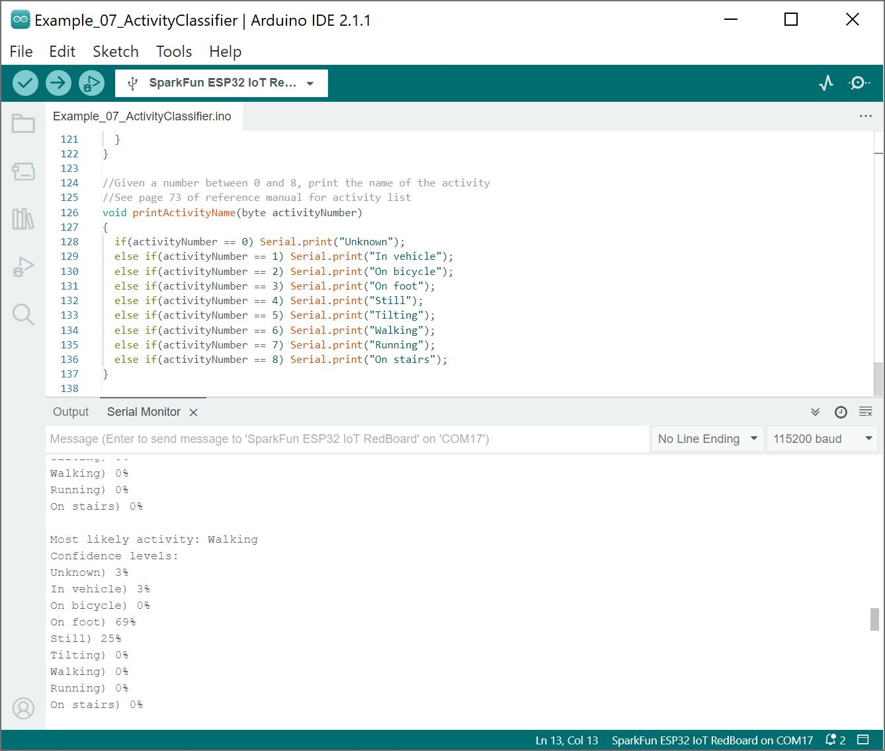</a></td>
    </tr>
  </table>

  <i>Having a hard time seeing output? Click on the image for a closer look.</i>

The BNO086 can determine the following activities:

  * In vehicle
  * On bicycle
  * On foot
  * Still
  * Tilting
  * Walking
  * Running
  * On stairs

If the sensor is not able to determine what is happening, the output will tell you that it was an "Unknown."

### Example 8 - Advanced Configuration

This example shows us how to configure the sensor on different addresses and I2C buses. Make sure to close the ADR jumper by adding a solder blob. You will also need to manually connect the I2C data and clock pins to the alternative port. For a quick test, you could use the [Qwiic cable with breadboard jumpers](https://www.sparkfun.com/products/14425) to connect the breakout board to the RedBoard IoT - ESP32's header sockets. Of course, soldering wire directly to the PTH is better for a more secure connection.

    <table>
        <tr>
            <th style="text-align: center; border: solid 1px #cccccc;">RedBoard IoT - ESP32
            </th>
            <th style="text-align: center; border: solid 1px #cccccc;">VR IMU Breakout - BNO086
            </th>
        </tr>
        <tr>
            <td style="text-align: center; border: solid 1px #cccccc;" bgcolor="#f2dede">3.3V
            </td>
            <td style="text-align: center; border: solid 1px #cccccc;" bgcolor="#f2dede">3.3V
            </td>
        </tr>
        <tr>
            <td style="text-align: center; border: solid 1px #cccccc;" bgcolor="#DDDDDD">GND
            </td>
            <td style="text-align: center; border: solid 1px #cccccc;" bgcolor="#DDDDDD">GND
            </td>
        </tr>
        <tr>
            <td style="text-align: center; border: solid 1px #cccccc;" bgcolor="#fff3cd">SCL1 (D17)
            </td>
            <td style="text-align: center; border: solid 1px #cccccc;" bgcolor="#fff3cd">SCL
            </td>
        </tr>
        <tr>
            <td style="text-align: center; border: solid 1px #cccccc;" bgcolor="#cce5ff">SDA1 (D25)
            </td>
            <td style="text-align: center; border: solid 1px #cccccc;" bgcolor="#cce5ff">SDA
            </td>
        </tr>    
        <tr>
            <td style="text-align: center; border: solid 1px #cccccc;" bgcolor="#cce5ff">A4
            </td>
            <td style="text-align: center; border: solid 1px #cccccc;" bgcolor="#cce5ff">INT
            </td>
        </tr>
        <tr>
            <td style="text-align: center; border: solid 1px #cccccc;" bgcolor="#d4edda">A5
            </td>
            <td style="text-align: center; border: solid 1px #cccccc;" bgcolor="#d4edda">RST
            </td>
        </tr>    
    </table>

  <table>
    <tr style="vertical-align:middle;">
     <td style="text-align: center; vertical-align: middle;"><a href="../assets/img/SparkFun_RedBoard_IoT_ESP32_BNO086_ALT_I2C_Hookup_bb.jpg">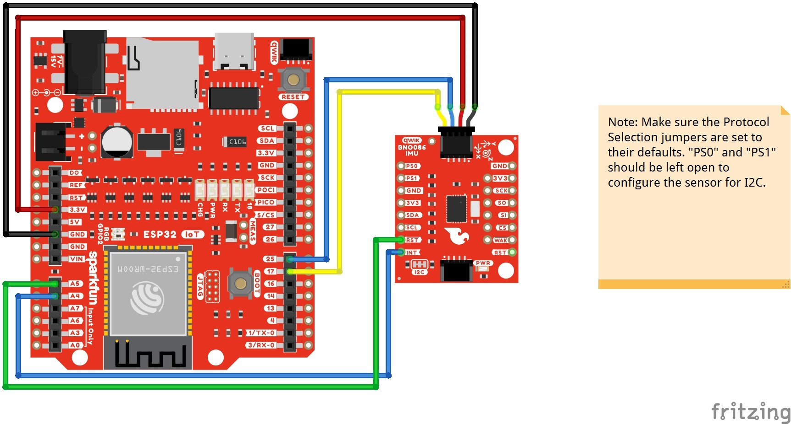</a></td>
    </tr>
  </table>

Open the example by navigating to **File** > **Examples** > **SparkFun BNO08X Cortex Based IMU** > **Example_08_AdvancedConfig**.

Select your board in the Tools menu (in our case **SparkFun ESP32 IoT RedBoard**) and the correct Port it enumerated on and click "Upload". After uploading the code, open the [Serial Monitor](https://learn.sparkfun.com/tutorials/terminal-basics) or terminal emulator of your choice with the baud rate set to **115200**.

  <table>
    <tr style="vertical-align:middle;">
     <td style="text-align: center; vertical-align: middle;"><a href="../assets/img/VR_IMU-BNO086_Arduino_Ex8_AdvancedConfiguration.JPG">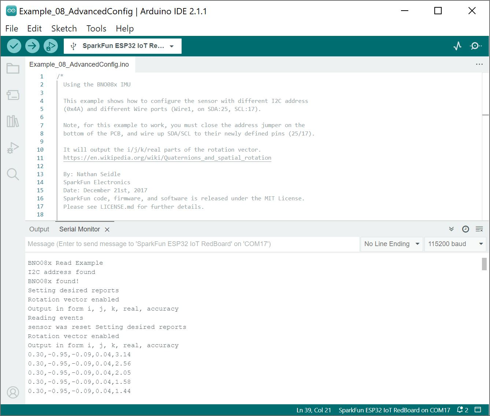</a></td>
    </tr>
  </table>

  <i>Having a hard time seeing output? Click on the image for a closer look.</i>

### Example 9 - Linear Accelerometer

The following example is similar to example 2, however we are reading the linear acceleration. What does this mean? Well, it's acceleration with gravity (~9.8m/s2) removed from the data! Open the example by navigating to **File** > **Examples** > **SparkFun BNO08X Cortex Based IMU** > **Example_09_LinearAccelerometer**.

Select your board in the Tools menu (in our case **SparkFun ESP32 IoT RedBoard**) and the correct Port it enumerated on and click "Upload". After uploading the code, open the [Serial Monitor](https://learn.sparkfun.com/tutorials/terminal-basics) or terminal emulator of your choice with the baud rate set to **115200**.

  <table>
    <tr style="vertical-align:middle;">
     <td style="text-align: center; vertical-align: middle;"><a href="../assets/img/VR_IMU-BNO086_Arduino_Ex9_LinearAccelerometer.JPG">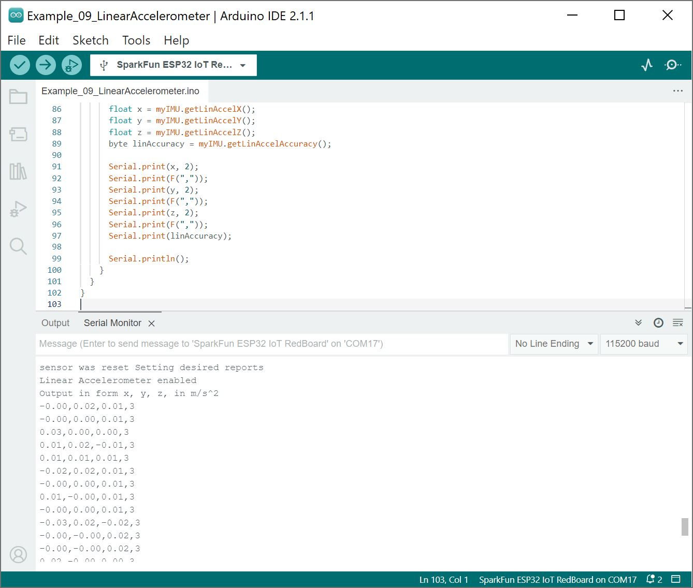</a></td>
    </tr>
  </table>

  <i>Having a hard time seeing output? Click on the image for a closer look.</i>

### Example 10 - Timestamp

This example is pretty much like example 1. The difference is that we add a timestamp for each rotation vector. Open the example by navigating to **File** > **Examples** > **SparkFun BNO08X Cortex Based IMU** > **Example_10_TimeStamp**.

Select your board in the Tools menu (in our case **SparkFun ESP32 IoT RedBoard**) and the correct Port it enumerated on and click "Upload". After uploading the code, open the [Serial Monitor](https://learn.sparkfun.com/tutorials/terminal-basics) or terminal emulator of your choice with the baud rate set to **115200**.

  <table>
    <tr style="vertical-align:middle;">
     <td style="text-align: center; vertical-align: middle;"><a href="../assets/img/VR_IMU-BNO086_Arduino_Ex10_Timestamp_and_Rotation_Vector.JPG">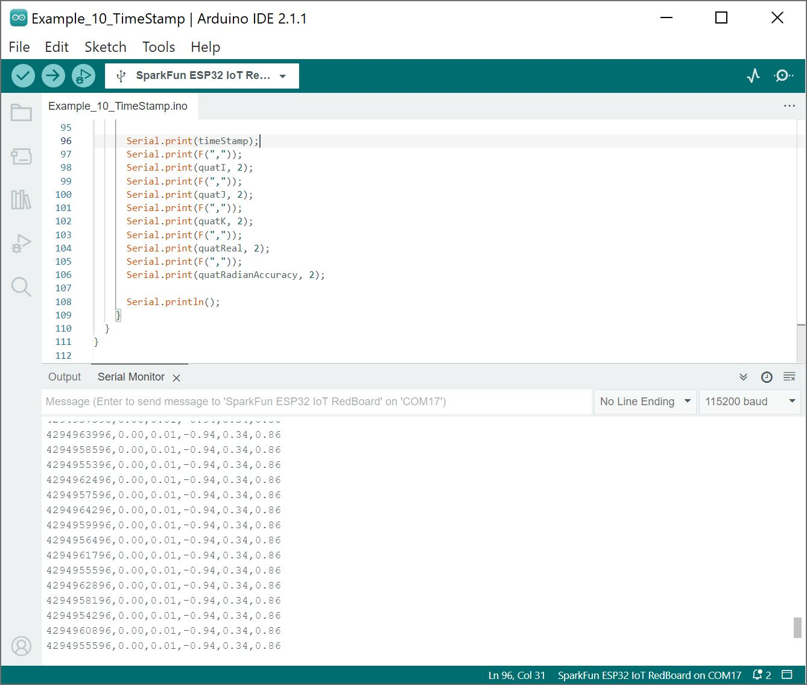</a></td>
    </tr>
  </table>

  <i>Having a hard time seeing output? Click on the image for a closer look.</i>

### Example 11 - Raw Readings

This example shows how to output the raw acceleration, gyroscope, and magnetometer values. Open the example by navigating to **File** > **Examples** > **SparkFun BNO08X Cortex Based IMU** > **Example_11_RawReadings**.

Select your board in the Tools menu (in our case **SparkFun ESP32 IoT RedBoard**) and the correct Port it enumerated on and click "Upload". After uploading the code, open the [Serial Monitor](https://learn.sparkfun.com/tutorials/terminal-basics) or terminal emulator of your choice with the baud rate set to **115200**.

  <table>
    <tr style="vertical-align:middle;">
     <td style="text-align: center; vertical-align: middle;"></td>
    </tr>
  </table>

  <i>Having a hard time seeing output? Click on the image for a closer look.</i>

### Example 12 - Gyro Integrated Rotation Vector

This example shows how to use the gyro integrated rotation vector. Open the example by navigating to **File** > **Examples** > **SparkFun BNO08X Cortex Based IMU** > **Example_12-GyroIntegratedRotationVector**.

Select your board in the Tools menu (in our case **SparkFun ESP32 IoT RedBoard**) and the correct Port it enumerated on and click "Upload". After uploading the code, open the [Serial Monitor](https://learn.sparkfun.com/tutorials/terminal-basics) or terminal emulator of your choice with the baud rate set to **115200**.

  <table>
    <tr style="vertical-align:middle;">
     <td style="text-align: center; vertical-align: middle;"><a href="../assets/img/VR_IMU-BNO086_Arduino_Ex12_Gyro_Integrated_Rotation_Vector.JPG">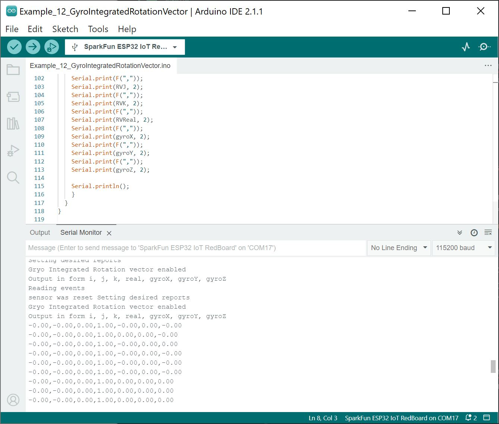</a></td>
    </tr>
  </table>

  <i>Having a hard time seeing output? Click on the image for a closer look.</i>

### Example 13 - Euler Angles

Open the example by navigating to **File** > **Examples** > **SparkFun BNO08X Cortex Based IMU** > **Example_13_EulerAngles**.

Select your board in the Tools menu (in our case **SparkFun ESP32 IoT RedBoard**) and the correct Port it enumerated on and click "Upload". After uploading the code, open the [Serial Monitor](https://learn.sparkfun.com/tutorials/terminal-basics) or terminal emulator of your choice with the baud rate set to **115200**.

 <table>
   <tr style="vertical-align:middle;">
    <td style="text-align: center; vertical-align: middle;"><a href="../assets/img/VR_IMU-BNO086_Arduino_Ex13_Euler_Angles_Pitch_Roll_Yaw.JPG">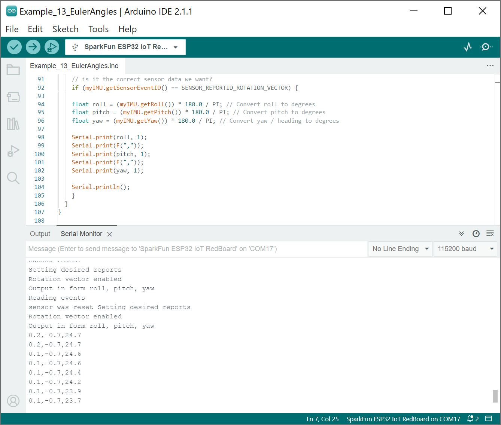</a></td>
   </tr>
 </table>

  <i>Having a hard time seeing output? Click on the image for a closer look.</i>

### Example 14 - Tare

Open the example by navigating to **File** > **Examples** > **SparkFun BNO08X Cortex Based IMU** > **Example_14_Tare**.

Select your board in the Tools menu (in our case **SparkFun ESP32 IoT RedBoard**) and the correct Port it enumerated on and click "Upload". After uploading the code, open the [Serial Monitor](https://learn.sparkfun.com/tutorials/terminal-basics) or terminal emulator of your choice with the baud rate set to **115200**.

 <table>
   <tr style="vertical-align:middle;">
    <td style="text-align: center; vertical-align: middle;"><a href="../assets/img/VR_IMU-BNO086_Arduino_Ex14_Tare.JPG">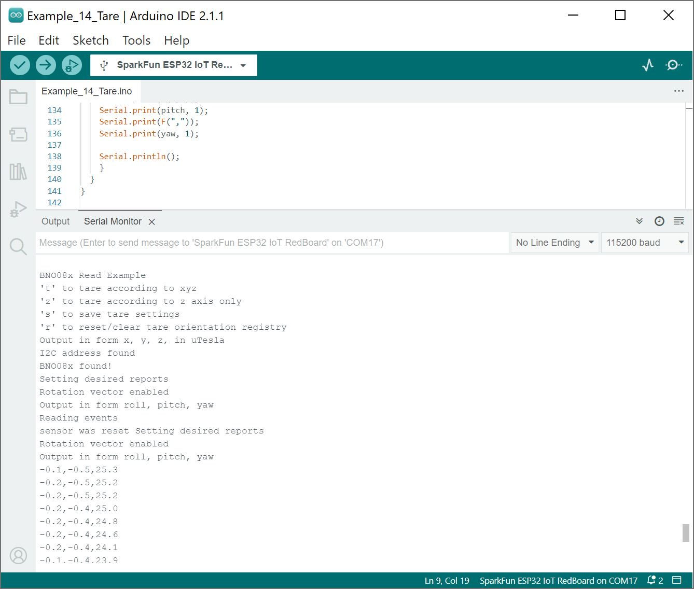</a></td>
   </tr>
 </table>

  <i>Having a hard time seeing output? Click on the image for a closer look.</i>

### Example 15 - Gravity

Open the example by navigating to **File** > **Examples** > **SparkFun BNO08X Cortex Based IMU** > **Example_15_Gravity**.

Select your board in the Tools menu (in our case **SparkFun ESP32 IoT RedBoard**) and the correct Port it enumerated on and click "Upload". After uploading the code, open the [Serial Monitor](https://learn.sparkfun.com/tutorials/terminal-basics) or terminal emulator of your choice with the baud rate set to **115200**.

 <table>
   <tr style="vertical-align:middle;">
    <td style="text-align: center; vertical-align: middle;"><a href="../assets/img/VR_IMU-BNO086_Arduino_Ex15_Gravity.JPG">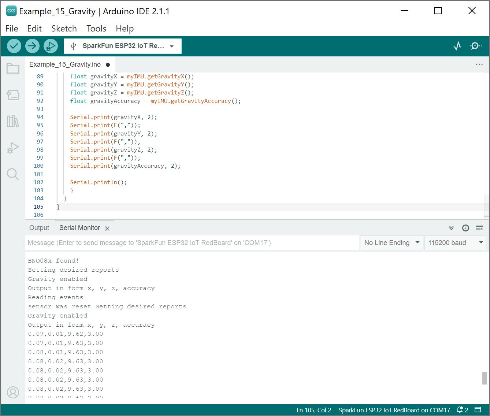</a></td>
   </tr>
 </table>

  <i>Having a hard time seeing output? Click on the image for a closer look.</i>

### Example 16 - Uncalibrated Gyro

Open the example by navigating to **File** > **Examples** > **SparkFun BNO08X Cortex Based IMU** > **Example_16_UncalibratedGyro**.

Select your board in the Tools menu (in our case **SparkFun ESP32 IoT RedBoard**) and the correct Port it enumerated on and click "Upload". After uploading the code, open the [Serial Monitor](https://learn.sparkfun.com/tutorials/terminal-basics) or terminal emulator of your choice with the baud rate set to **115200**.

 <table>
   <tr style="vertical-align:middle;">
    <td style="text-align: center; vertical-align: middle;"><a href="../assets/img/VR_IMU-BNO086_Arduino_Ex16_Uncalibrated_Gyro.JPG">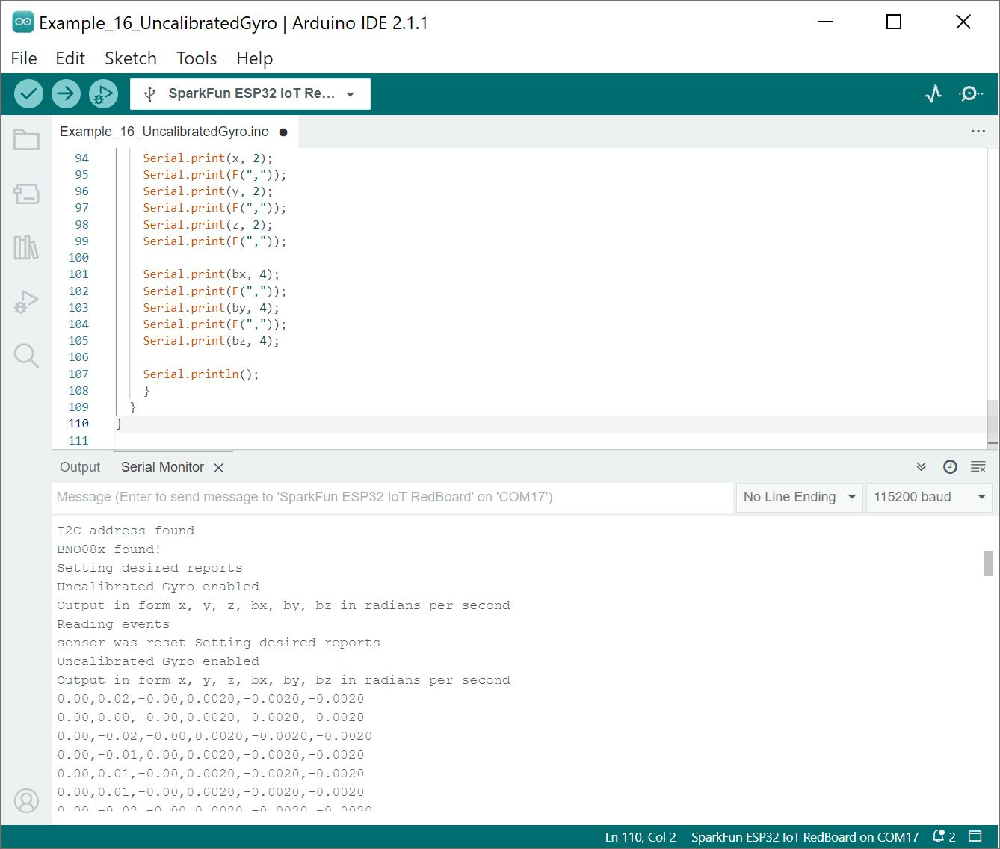</a></td>
   </tr>
 </table>

  <i>Having a hard time seeing output? Click on the image for a closer look.</i>

