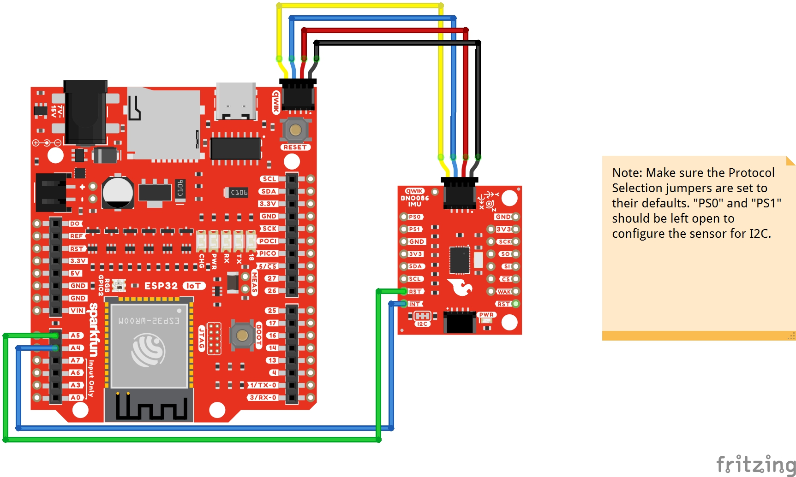
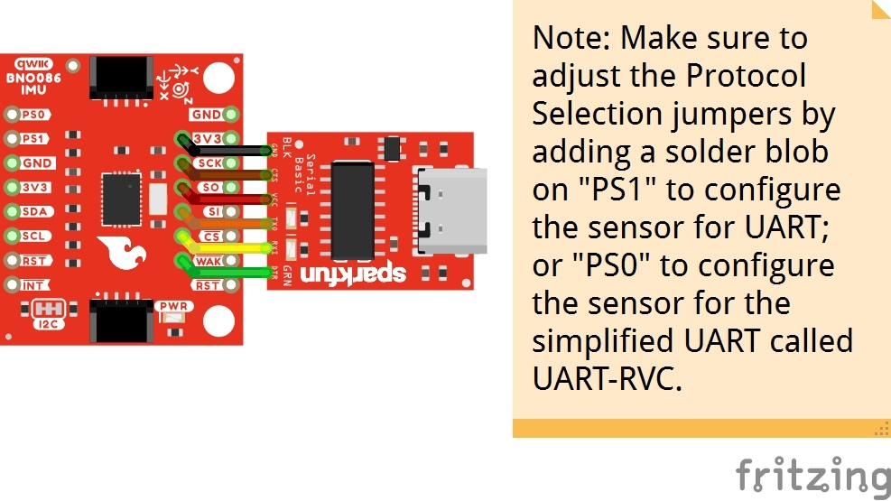
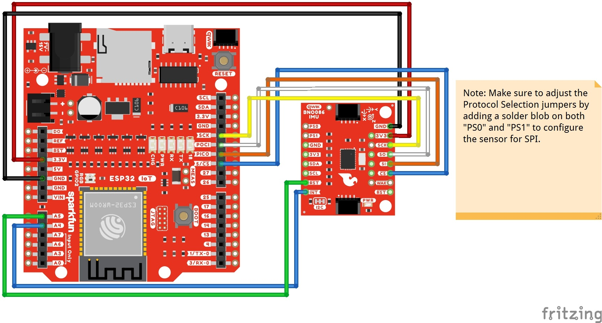

!!! note
    Unfortunately, users are not able to use an Arduino Uno or RedBoard with an ATmega328P due the demands of the BNO086 IC. We recommend using the ESP32.

### Connecting via Qwiic Port, Reset, & Interrupt Pins

!!! note
    As of v1.0.3, you will need to wire up the reset and interrupt pins. Using only the I2C port was not sufficient enough to get the BNO086 to work reliably with a microcontroller.  

    The I/O pins have also been changed for the reset and interrupt pins! Make sure to adjust your connections accordingly.

You will need a powerful micrcontroller to process the data when using the BNO086. In this case, we used an ESP32 (we specifically tested the Arduino Library with the SparkFun IoT RedBoard - ESP32). Besides connecting a Qwiic cable, you also need to wire up the reset and interrupt pins. This is a more reliable connection and is recommended.

The table and image below shows the connections between the SparkFun IoT RedBoard - ESP32 and the BNO086. While you can use IC hooks for a temporary connection, we recommending soldering for a secure connection. You can choose between a combination of [header pins and jumper wires](https://learn.sparkfun.com/tutorials/how-to-solder-through-hole-soldering/all), or [stripping wire and soldering the wire](https://learn.sparkfun.com/tutorials/working-with-wire/all) directly to the board.

-   <a href="https://learn.sparkfun.com/tutorials/how-to-solder-through-hole-soldering/all">
      <figure markdown>
        
      </figure>
    </a>

    ---

    <a href="https://learn.sparkfun.com/tutorials/how-to-solder-through-hole-soldering/all">
      <b>How to Solder: Through Hole Soldering</b>
    </a>
<!-- ----------WHITE SPACE BETWEEN GRID CARDS---------- -->
-   <a href="https://learn.sparkfun.com/tutorials/working-with-wire/all">
      <figure markdown>
        
      </figure>
    </a>

    ---

    <a href="https://learn.sparkfun.com/tutorials/working-with-wire/all">
      <b>Working with Wire</b>
    </a>
<!-- ----------WHITE SPACE BETWEEN GRID CARDS---------- -->

    <table>
        <tr>
            <th style="text-align: center; border: solid 1px #cccccc;">RedBoard IoT - ESP32
            </th>
            <th style="text-align: center; border: solid 1px #cccccc;">VR IMU Breakout - BNO086
            </th>
        </tr>
        <tr>
            <td style="text-align: center; border: solid 1px #cccccc;" bgcolor="#f2dede">3.3V (3.3V, Qwiic Port)
            </td>
            <td style="text-align: center; border: solid 1px #cccccc;" bgcolor="#f2dede">3.3V
            </td>
        </tr>
        <tr>
            <td style="text-align: center; border: solid 1px #cccccc;" bgcolor="#DDDDDD">GND (GND, Qwiic Port)
            </td>
            <td style="text-align: center; border: solid 1px #cccccc;" bgcolor="#DDDDDD">GND
            </td>
        </tr>
        <tr>
            <td style="text-align: center; border: solid 1px #cccccc;" bgcolor="#fff3cd">SCL (D22, Qwiic Port)
            </td>
            <td style="text-align: center; border: solid 1px #cccccc;" bgcolor="#fff3cd">SCL
            </td>
        </tr>
        <tr>
            <td style="text-align: center; border: solid 1px #cccccc;" bgcolor="#cce5ff">SDA (D21, Qwiic Port)
            </td>
            <td style="text-align: center; border: solid 1px #cccccc;" bgcolor="#cce5ff">SDA
            </td>
        </tr>    
        <tr>
            <td style="text-align: center; border: solid 1px #cccccc;" bgcolor="#cce5ff">A4
            </td>
            <td style="text-align: center; border: solid 1px #cccccc;" bgcolor="#cce5ff">INT
            </td>
        </tr>
        <tr>
            <td style="text-align: center; border: solid 1px #cccccc;" bgcolor="#d4edda">A5
            </td>
            <td style="text-align: center; border: solid 1px #cccccc;" bgcolor="#d4edda">RST
            </td>
        </tr>
    </table>

  <table>
    <tr style="vertical-align:middle;">
     <td style="text-align: center; vertical-align: middle;"></td>
    </tr>
  </table>

!!!note
    For users using a different communication protocol, make sure to adjust the solder joints for PS0 and PS1 before connecting to a UART or SPI port.

### Connecting via UART

For users interested in using the serial UART protocol to communicate with the sensor through a computer's USB port, you can connect a serial-to-USB connector directly to the board.

Before connecting, make sure to add a solder jumper on PS1 to configure the board for UART protocol as stated earlier in the Hardware Overview.

    <table>
        <tr>
            <th style="text-align: center; border: solid 1px #cccccc;">PS0
            </th>
            <th style="text-align: center; border: solid 1px #cccccc;">PS1
            </th>
            <th style="text-align: center; border: solid 1px #cccccc;">Interface
            </th>
            <th style="text-align: center; border: solid 1px #cccccc;">Note
            </th>
        </tr>
        <tr>
            <td style="text-align: center; border: solid 1px #cccccc;">0
            </td>
            <td style="text-align: center; border: solid 1px #cccccc;">0
            </td>
            <td style="text-align: center; border: solid 1px #cccccc;">I2C
            </td>
            <td style="text-align: center; border: solid 1px #cccccc;">
            </td>
        </tr>
        <tr>
            <td style="text-align: center; border: solid 1px #cccccc;">1
            </td>
            <td style="text-align: center; border: solid 1px #cccccc;">0
            </td>
            <td style="text-align: center; border: solid 1px #cccccc;">UART-RVC
            </td>
            <td style="text-align: center; border: solid 1px #cccccc;">
            </td>
        </tr>
        <tr>
            <td style="text-align: center; border: solid 1px #cccccc;" bgcolor="#f2dede">0
            </td>
            <td style="text-align: center; border: solid 1px #cccccc;" bgcolor="#f2dede">1
            </td>
            <td style="text-align: center; border: solid 1px #cccccc;" bgcolor="#f2dede">UART
            </td>
            <td style="text-align: center; border: solid 1px #cccccc;" bgcolor="#f2dede">Add solder blob to the jumper to set to 1.
            </td>
        </tr>
        <tr>
            <td style="text-align: center; border: solid 1px #cccccc;">1
            </td>
            <td style="text-align: center; border: solid 1px #cccccc;">1
            </td>
            <td style="text-align: center; border: solid 1px #cccccc;"">SPI
            </td>
            <td style="text-align: center; border: solid 1px #cccccc;">
            </td>
        </tr>
    </table>

The table below shows how to connect the VR IMU Breakout BNO086's UART port to a Serial Basic. You can angle header pins against the PTHs and hold the boards together with one hand for a temporary connection. However, we recommending soldering to the connection for a reliable and secure connection. You can choose between a combination of [header pins and jumper wires](https://learn.sparkfun.com/tutorials/how-to-solder-through-hole-soldering/all), or [stripping wire and soldering the wire](https://learn.sparkfun.com/tutorials/working-with-wire/all) directly to the board.

    <table>
        <tr>
            <th style="text-align: center; border: solid 1px #cccccc;">VR IMU Breakout - BNO086
            </th>
            <th style="text-align: center; border: solid 1px #cccccc;">3.3V Serial Basic
            </th>
            <th style="text-align: center; border: solid 1px #cccccc;">Wire Color
            </th>
        </tr>
        <tr>
            <td style="text-align: center; border: solid 1px #cccccc;" bgcolor="#DDDDDD">GND
            </td>
            <td style="text-align: center; border: solid 1px #cccccc;" bgcolor="#DDDDDD">GND
            </td>
            <td style="text-align: center; border: solid 1px #cccccc;" bgcolor="#DDDDDD">BLK
            </td>
        </tr>
        <tr>
            <td style="text-align: center; border: solid 1px #cccccc;" bgcolor="#C4A484">
            </td>
            <td style="text-align: center; border: solid 1px #cccccc;" bgcolor="#C4A484">CTS
            </td>
            <td style="text-align: center; border: solid 1px #cccccc;" bgcolor="#C4A484">
            </td>
        </tr>
        <tr>
            <td style="text-align: center; border: solid 1px #cccccc;" bgcolor="#f2dede">3V3
            </td>
            <td style="text-align: center; border: solid 1px #cccccc;" bgcolor="#f2dede">3.3V
            </td>
            <td style="text-align: center; border: solid 1px #cccccc;" bgcolor="#f2dede">
            </td>
        </tr>
        <tr>
            <td style="text-align: center; border: solid 1px #cccccc;" bgcolor="#ffdaaf">RXI
            </td>
            <td style="text-align: center; border: solid 1px #cccccc;" bgcolor="#ffdaaf">TXO
            </td>
            <td style="text-align: center; border: solid 1px #cccccc;" bgcolor="#ffdaaf">
            </td>
        </tr>
        <tr>
            <td style="text-align: center; border: solid 1px #cccccc;" bgcolor="#fff3cd">TXO
            </td>
            <td style="text-align: center; border: solid 1px #cccccc;" bgcolor="#fff3cd">RXI
            </td>
            <td style="text-align: center; border: solid 1px #cccccc;" bgcolor="#fff3cd">
            </td>
        </tr><tr>
            <td style="text-align: center; border: solid 1px #cccccc;" bgcolor="#d4edda">
            </td>
            <td style="text-align: center; border: solid 1px #cccccc;" bgcolor="#d4edda">DTR
            </td>
            <td style="text-align: center; border: solid 1px #cccccc;" bgcolor="#d4edda">GRN
            </td>
        </tr>
    </table>

!!!note
    You will need to be careful when soldering header pins to the edge pins and the UART located at the center of the board. For users that solder header pins to the edge of the board to mate with a breadboard, you will need to solder header pins facing the other way for the UART header so that the center pins do not connect to the same rails. The same goes with users that are using right angle header pins as well.

    Of course, you can cut a [six wire jumper wire cable](https://www.sparkfun.com/products/10371) and wire strip them before connecting to the 1x6 header as well.

The UART interface is in the middle of the board, with the black and green pins labeled as BLK and GRN. As stated earlier, these serial pins have been arranged to work with our [Serial Basic](https://www.sparkfun.com/products/15096) board to make interfacing to a computer simple and fast. Once the header pins are soldered, align the GRN and BLK labels so that the serial connection is properly connected and slide the male header pins into the female header sockets.

  <table>
    <tr style="vertical-align:middle;">
     <td style="text-align: center; vertical-align: middle;"></td>
    </tr>
  </table>

### Connecting via SPI

For users interested in using the [SPI protocol](https://learn.sparkfun.com/tutorials/serial-peripheral-interface-spi) to communicate with the sensor, there are few examples in the Arduino Library. You can use those examples as a basis to adjust the I2C examples to use it with SPI.

Before connecting, make sure to add a solder jumper on PS0 and PS1 to configure the board for SPI protocol as stated earlier in the Hardware Overview.

!!! note
    As of v1.0.3, the I/O pins have also been changed for the CS, reset, interrupt pins! Make sure to adjust your connections accordingly.

    <table>
        <tr>
            <th style="text-align: center; border: solid 1px #cccccc;">PS0
            </th>
            <th style="text-align: center; border: solid 1px #cccccc;">PS1
            </th>
            <th style="text-align: center; border: solid 1px #cccccc;">Interface
            </th>
            <th style="text-align: center; border: solid 1px #cccccc;">Note
            </th>
        </tr>
        <tr>
            <td style="text-align: center; border: solid 1px #cccccc;">0
            </td>
            <td style="text-align: center; border: solid 1px #cccccc;">0
            </td>
            <td style="text-align: center; border: solid 1px #cccccc;">I2C
            </td>
            <td style="text-align: center; border: solid 1px #cccccc;">
            </td>
        </tr>
        <tr>
            <td style="text-align: center; border: solid 1px #cccccc;">1
            </td>
            <td style="text-align: center; border: solid 1px #cccccc;">0
            </td>
            <td style="text-align: center; border: solid 1px #cccccc;">UART-RVC
            </td>
            <td style="text-align: center; border: solid 1px #cccccc;">
            </td>
        </tr>
        <tr>
            <td style="text-align: center; border: solid 1px #cccccc;">0
            </td>
            <td style="text-align: center; border: solid 1px #cccccc;">1
            </td>
            <td style="text-align: center; border: solid 1px #cccccc;">UART
            </td>
            <td style="text-align: center; border: solid 1px #cccccc;">
            </td>
        </tr>
        <tr>
            <td style="text-align: center; border: solid 1px #cccccc;" bgcolor="#f2dede">1
            </td>
            <td style="text-align: center; border: solid 1px #cccccc;" bgcolor="#f2dede">1
            </td>
            <td style="text-align: center; border: solid 1px #cccccc; "bgcolor="#f2dede">SPI
            </td>
            <td style="text-align: center; border: solid 1px #cccccc;" bgcolor="#f2dede">Add solder blob to the jumpers to set to 1.
            </td>
        </tr>
    </table>

The table below shows how to connect the SparkFun IoT RedBoard - ESP32 to the VR IMU Breakout BNO086's SPI port. As stated earlier for the I2C, you could use IC hooks for initial testing. However, we recommending soldering to the connection for a reliable and secure connection. You can choose between a combination of [header pins and jumper wires](https://learn.sparkfun.com/tutorials/how-to-solder-through-hole-soldering/all), or [stripping wire and soldering the wire](https://learn.sparkfun.com/tutorials/working-with-wire/all) directly to the board.

    <table>
        <tr>
            <th style="text-align: center; border: solid 1px #cccccc;">RedBoard IoT - ESP32
            </th>
            <th style="text-align: center; border: solid 1px #cccccc;">VR IMU Breakout - BNO086
            </th>
        </tr>
        <tr>
            <td style="text-align: center; border: solid 1px #cccccc;" bgcolor="#f2dede">3.3V
            </td>
            <td style="text-align: center; border: solid 1px #cccccc;" bgcolor="#f2dede">3.3V
            </td>
        </tr>
        <tr>
            <td style="text-align: center; border: solid 1px #cccccc;" bgcolor="#DDDDDD">GND
            </td>
            <td style="text-align: center; border: solid 1px #cccccc;" bgcolor="#DDDDDD">GND
            </td>
        </tr>
        <tr>
            <td style="text-align: center; border: solid 1px #cccccc;" bgcolor="#cce5ff">D5
            </td>
            <td style="text-align: center; border: solid 1px #cccccc;" bgcolor="#cce5ff">CS
            </td>
        </tr>
        <tr>
            <td style="text-align: center; border: solid 1px #cccccc;" bgcolor="#ffdaaf">PICO (D23)
            </td>
            <td style="text-align: center; border: solid 1px #cccccc;" bgcolor="#ffdaaf">SI
            </td>
        </tr>
        <tr>
            <td style="text-align: center; border: solid 1px #cccccc;" bgcolor="#ffffff">POCI (D19)
            </td>
            <td style="text-align: center; border: solid 1px #cccccc;" bgcolor="#ffffff">SO
            </td>
        </tr>
        <tr>
            <td style="text-align: center; border: solid 1px #cccccc;" bgcolor="#fff3cd">SCK (D18)
            </td>
            <td style="text-align: center; border: solid 1px #cccccc;" bgcolor="#fff3cd">SCK
            </td>
        </tr>    
        <tr>
            <td style="text-align: center; border: solid 1px #cccccc;" bgcolor="#cce5ff">A4
            </td>
            <td style="text-align: center; border: solid 1px #cccccc;" bgcolor="#cce5ff">INT
            </td>
        </tr>
        <tr>
            <td style="text-align: center; border: solid 1px #cccccc;" bgcolor="#d4edda">A5
            </td>
            <td style="text-align: center; border: solid 1px #cccccc;" bgcolor="#d4edda">RST
            </td>
        </tr>
    </table>

  <table>
    <tr style="vertical-align:middle;">
     <td style="text-align: center; vertical-align: middle;"></td>
    </tr>
  </table>

