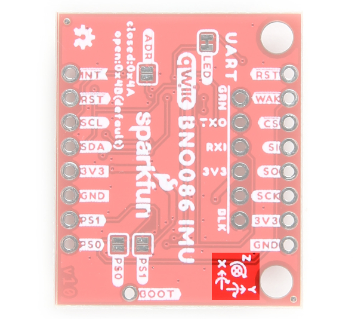

Let's look over a few characteristics of the BNO086 sensor so we know a bit more about how it behaves. These characteristics were taken from the datasheet. For more information, make sure to check out the datasheet that is linked in the Resources section.

  <table>
    <tr style="vertical-align:middle;">
     <td style="text-align: center; vertical-align: middle;"></td>
    </tr>
  </table>

* I2C (Default): Up to 400kHz
* SPI: Up to 3MHz
* UART: 3Mbps
* Rotation Vector
    * Dynamic Error: 3.5°
    * Static Error: 2.0°
* Gaming Rotation Vector
    * Dynamic Error: 2.5°
    * Static Error: 1.5°
    * Dynamic Heading Drift: 0.5° / min
* Geomagnetic Rotation Vector
    * Dynamic Rotation Error: 4.5°
    * Static Rotation Error: 3.0°
* Gravity Angle Error: 1.5°
* Linear Acceleration Accuracy: 0.35m/s2
* Accelerometer Accuracy: 0.3m/s2
* Gyroscope Accuracy: 3.1° / sec
* Magnetometer Accuracy: 1.4µT

!!!note
    Keep in mind the location of the labels on the top and bottom of the board. When rotating the board about the x-axis to view the bottom labels, you will notice that the letters are not right side up. You will need to rotate the board about the y-axis to view the letters.
    

      <table>
        <tr style="vertical-align:middle;">
         <td style="text-align: center; vertical-align: middle;"></td>
         <td style="text-align: center; vertical-align: middle;"></td>
        </tr>
      </table>
    

### Power

The operating voltage is between 2.4V-3.6V (note that VDDIO and VDD are tied together on the breakout board). We will assume that users will be using this with the Qwiic Connect System and a 3.3V microcontroller, which is typically **3.3V**. We recommend matching the logic levels so that they are the same as the operating voltage (e.g. _3.3V_).  You can apply 3.3V to the board from the 3V3 pin on either edge of the board, in the middle of the board, or either of the Qwiic connectors. There are also a few GND pins located throughout the board and via the Qwiic connectors.

  <table>
    <tr style="vertical-align:middle;">
     <td style="text-align: center; vertical-align: middle;"></td>
    </tr>
  </table>

### I2C and Qwiic Connectors

The board includes two Qwiic connectors on each side of the board. For users that need to solder directly to the board, the pins are also broken out on the edge PTH. The I2C data and clock lines are also tied to 2.2k&ohm; pull-up resistors. The BNO086 supports standard fast mode and can communicate over this interface at up to 400kHz.

  <table>
    <tr style="vertical-align:middle;">
     <td style="text-align: center; vertical-align: middle;"></td>
    </tr>
  </table>

The default address of the board is set to **0x4B**. The alternative address is _0x4A_. The protocol selection is also set for I2C by default. These can be adjusted based on the jumpers on the back of the board. For more information, check out the section about the jumpers.

!!!note
    The timing for the BNO086 is finicky on the I2C port and the Arduino Library v1.0 does not currently support more than one BNO086 on the same line. We also do not recommend using a Qwiic Mux between the microcontroller and BNO086 to ensure that the packets are sent reliably.

### SPI

A few of the SPI pins have more than one function. We'll focus on the four SPI pins below. The image will also highlight the pins that are tied together.

* **SO** &mdash; This is an output pin for POCI (Peripheral Out, Controller In). The device sends data to the controller on this line. This is also connected to the I2C's SDA and UART's TXO pin.
* **SI** &mdash; This is an input pin for the PICO (Peripheral In, Controller Out). Device receives data from the microcontroller on this line. This is also connected to the address jumper. Tie to 3.3V to change I2C address from **0x4A** to _0x4B_.
* **SCK** &mdash; This is an input for the SPI clock. This is also connected to the I2C's SCL and UART's RXI pin.
* <b>CS</b> &mdash; This is an input for the SPI chip select pin and active low. It is used to as a clock signal to synchronize controller and peripheral.

  <table>
    <tr style="vertical-align:middle;">
     <td style="text-align: center; vertical-align: middle;"></td>
    </tr>
  </table>

The protocol selection is set for I2C by default. You will need to adjust the jumpers on the back of the board for SPI. For more information, check out the section about the jumpers.

!!!note
    You may not recognize the PICO/POCI labels for SPI pins. SparkFun has joined with other members of OSHWA in a resolution to move away from using "Master" and "Slave" to describe signals between the controller and the peripheral. Check out [this page](https://www.sparkfun.com/spi_signal_names)for more on our reasoning behind this change. You can also see OSHWA's resolution [here](https://www.oshwa.org/a-resolution-to-redefine-spi-signal-names).

!!!note
    The Arduino Library is focused more on I2C compared to the SPI protocol. To browse a few of the examples that are available, make sure to [check out the SPI folder](https://github.com/sparkfun/SparkFun_BNO08x_Arduino_Library/tree/main/examples/SPI) after installing the Arduino Library.

### UART

In the middle of the board, are the serial UART pins. You can also use the UART interface at up to 3 Mbps or a simplified UART called UART-RVC (Used for Robotic Vacuum Cleaners) which can run at a data rate of 115200 kbps. These serial pins have been arranged to work with our Serial Basic board to make interfacing to a computer simple and fast.  This is for users that want to connect to a 3.3V UART-to-Serial converter (such as the [Serial Basic Breakouts](https://www.sparkfun.com/products/15096)). The GRN and BLK labels help align the serial connection properly. The UART pins have more than one function. We'll focus on the two UART pins below. The image will also highlight the pins that are tied together.

* **TXO** &mdash; This is an output pin for serial UART transmit pin. Data is sent out to the microcontroller to this pin. This is also connected to the I2C's SDA and SPI's POCI pin.
* **RXI** &mdash; This is an input pin for the serial UART receive pin. Data is received from the microcontroller to this pin. This is also connected to the I2C's SCL and SPI's SCK pin.

  <table>
    <tr style="vertical-align:middle;">
     <td style="text-align: center; vertical-align: middle;"></td>
    </tr>
  </table>

The protocol selection is set for I2C by default. You will need to adjust the jumpers on the back of the board for the serial UART. For more information, check out the section about the jumpers.

### Reference Axis

For easy reference, we've documented the IMU's vectors with 3D Cartesian coordinate axes on the top and bottom side of the board. Make sure to orient and mount the board correctly so you know which way the BNO086's data is pointing. Remember, it's all relative.

  <table>
    <tr style="vertical-align:middle;">
     <td style="text-align: center; vertical-align: middle;"></td>
     <td style="text-align: center; vertical-align: middle;"></td>
    </tr>
  </table>

### LED

There is one LED on the board. The LED lights up when the board is powered with 3.3V. There is a jumper on the back if you decide to disable the LED.

  <table>
    <tr style="vertical-align:middle;">
     <td style="text-align: center; vertical-align: middle;"></td>
    </tr>
  </table>

### Miscellaneous Pins

Below are some additional pins that are broken out for the BNO086.

* <b>RST</b> &mdash; The reset signal pin is an input pin and it is active low. Pull it low to reset the IC. You can find this on both sides of the board.
* <b>INT</b> &mdash; The interrupt pin is an output pin and active low. When BNO080 is ready for communication, it will pull this pin low.
* <b>WAK</b> &mdash; The wake signal pin is an input pin and it is active low. Pull it low to wake the BNO086's processor from sleep mode.
* **BOOT** &mdash; The BOOT pin next to the Qwiic connector is necessary for configuration of the communication mode. If the BOOT pin is low upon reset or power up, the chip will go into bootloader mode to allow for programming of new firmware.

  <table>
    <tr style="vertical-align:middle;">
     <td style="text-align: center; vertical-align: middle;"></td>
    </tr>
  </table>

### Jumpers

There are a few jumper pads available on the top and bottom of the board. Most of the jumpers are on the bottom. For more information on modifying the jumpers, check out our [tutorial on working with jumper pads and PCB traces](https://learn.sparkfun.com/tutorials/how-to-work-with-jumper-pads-and-pcb-traces).

* **I2C** &mdash; On the top side of the board, the I2C jumpers are closed by default. By cutting the traces between the jumper pads, it will disconnect to the 2.2kΩ pull-up resistors for the I2C bus. Most of the time you can leave these alone unless your project requires you to [connect the pull-up resistors](https://learn.sparkfun.com/tutorials/i2c/all#i2c-at-the-hardware-level).
* **LED** &mdash; On the bottom side of the board, the LED jumper is closed by default. Cut this trace to disable the power LED that is connected to 3.3V.
* **ADR** &mdash; On the bottom side of the board, the address pin selects the I2C address of the BNO086 and it is open by default. As indicated by the silkscreen, the address is currently `0x48`. To change the address to the alternative value of `0x4A`, simply add a solder blob between the two pads. Make sure to also modify your code to adjust for the alternative address.
* **PS0** &mdash; On the bottom side of the board, the PS0 is used with PS1. The acronym stands for Protocol Selection and it is used for the configuration of the communication interface. It is open by default (i.e. 0). Adding a solder blob on either will change the configuration from I2C to UART-RVC, UART, or SPI. Check out the table below to configure the jumpers.
* **PS1** &mdash; On the bottom side of the board, the PS is used with PS0. The acronym stands for Protocol Selection and it is used for the configuration of the communication interface. It is open by default (i.e. 0). Adding a solder blob on either will change the configuration from I2C to UART-RVC, UART, or SPI. Check out the table below to configure the jumpers.

  <table>
    <tr style="vertical-align:middle;">
     <td style="text-align: center; vertical-align: middle;"></td>
     <td style="text-align: center; vertical-align: middle;"></td>
    </tr>
  </table>

You can use the **PS0** and **PS1** jumpers to change the communication protocol that the BNO080 is using. The jumpers are left open (0) by default, and the following configurations will allow for their corresponding communications protocols.

    <table>
        <tr>
            <th style="text-align: center; border: solid 1px #cccccc;">PS0
            </th>
            <th style="text-align: center; border: solid 1px #cccccc;">PS1
            </th>
            <th style="text-align: center; border: solid 1px #cccccc;">Interface
            </th>
        </tr>
        <tr>
            <td style="text-align: center; border: solid 1px #cccccc;">0
            </td>
            <td style="text-align: center; border: solid 1px #cccccc;">0
            </td>
            <td style="text-align: center; border: solid 1px #cccccc;">I2C

            </td>
        </tr>
        <tr>
            <td style="text-align: center; border: solid 1px #cccccc;">1
            </td>
            <td style="text-align: center; border: solid 1px #cccccc;">0
            </td>
            <td style="text-align: center; border: solid 1px #cccccc;">UART-RVC
            </td>
        </tr>
        <tr>
            <td style="text-align: center; border: solid 1px #cccccc;">0
            </td>
            <td style="text-align: center; border: solid 1px #cccccc;">1
            </td>
            <td style="text-align: center; border: solid 1px #cccccc;">UART
            </td>
        </tr>
        <tr>
            <td style="text-align: center; border: solid 1px #cccccc;">1
            </td>
            <td style="text-align: center; border: solid 1px #cccccc;">1
            </td>
            <td style="text-align: center; border: solid 1px #cccccc;">SPI
            </td>
        </tr>
    </table>

### Board Dimensions

The board is 1.0" x 1.2" (25.4mm x 30.48mm), which is slightly longer than a typical 1.0"x1.0" Qwiic sized board. There are 2x mounting holes on one side of the board.

  <table>
    <tr style="vertical-align:middle;">
     <td style="text-align: center; vertical-align: middle;"></td>
    </tr>
  </table>

