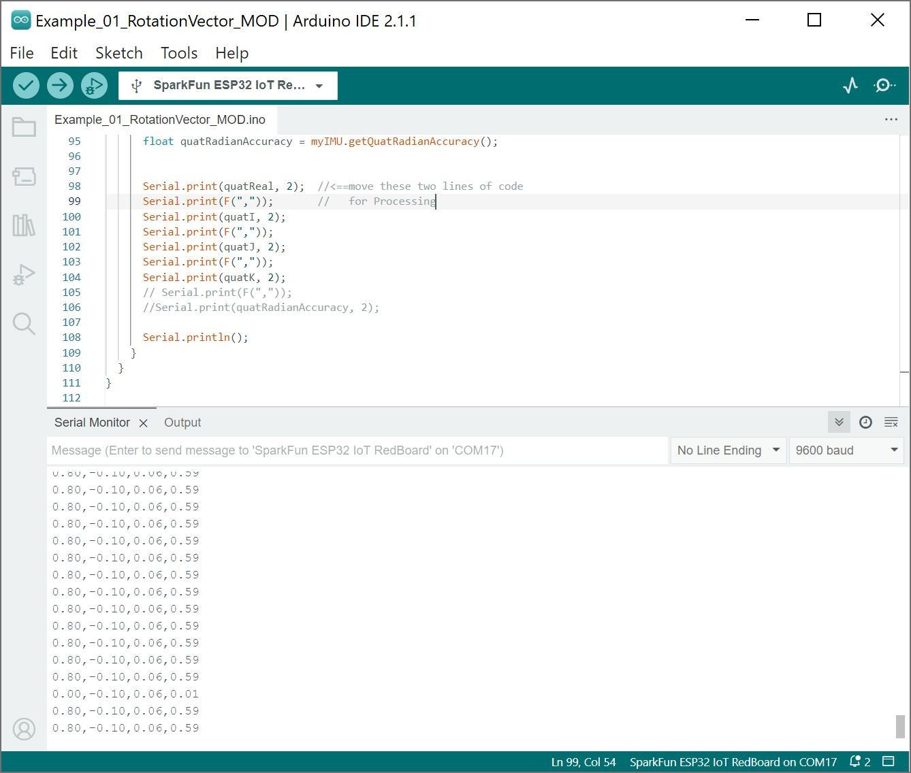
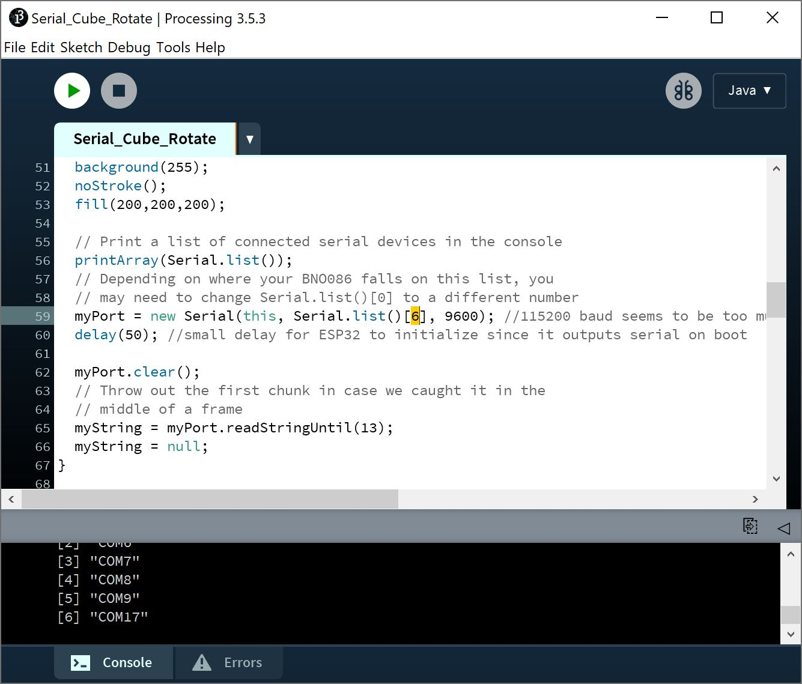
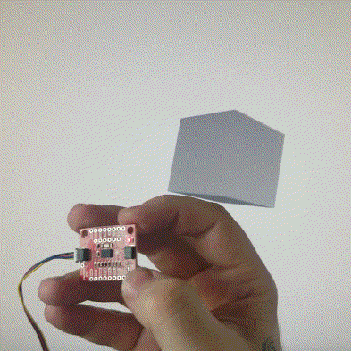

This section is a fun bonus example that rotates a cube in Processing based on the BNO086's sensor rotation vector's readings. This extra example is not included in the SparkFun VR IMU BNO08X Arduino Library as it requires Processing. To grab it, go ahead and download or clone the [SparKFun VR IMU Breakout BNO086 QWIIC hardware repo](https://github.com/sparkfun/SparkFun_VR_IMU_Breakout_BNO086_QWIIC).

<div style="text-align: center"><a href="https://github.com/sparkfun/SparkFun_VR_IMU_Breakout_BNO086_QWIIC/archive/refs/heads/main.zip" target="download_BNO086_hardware_repo" class="md-button">Download SparkFun VR IMU Breakout - BNO086 Qwiic GitHub Hardware Repo (ZIP)</a></div>


### Upload Modified Arduino Example 1's Rotation Vector

Processing listens for serial data, so we'll need to get our Arduino (i.e. RedBoard IoT - ESP32) producing serial data that makes sense to Processing. For this case, we will be using the example 1's rotation vector. However, we will be modifying it by sending only the comma seperated values to the serial port.

After unzipping the compressed files, navigate to the hardware repo's folder and open the example: ... **SparkFun_VR_IMU_Breakout_BNO086_QWIIC** > **Software** > **Arduino** > **Example_01_RotationVector_MOD** > **Example_01_RotationVector_MOD.ino**. This modified sketch simply prints a list of our quaternions separated by a comma over serial for Processing to listen to. You will also notice that the sequence of values is adjusted slightly for the Processing by moving the Real before the real value before i, j, and k. We also adjusted the baud rate to allow Processing some time to process the data.

Select your board in the Tools menu (in our case **SparkFun ESP32 IoT RedBoard**) and the correct Port it enumerated on and click "Upload". After uploading the code, open the [Serial Monitor](https://learn.sparkfun.com/tutorials/terminal-basics) or terminal emulator of your choice with the baud rate set to **9600**.

<div style="text-align: center;">
  <table>
    <tr style="vertical-align:middle;">
     <td style="text-align: center; vertical-align: middle;"><a href="../assets/img/VR_IMU-BNO086_Arduino_Ex1_Rotation_Vector_MOD.JPG"></a></td>
    </tr>
  </table>
</div>


### Run the "Serial Cube Rotate" Processing Demo

Once this sketch is uploaded, we need to tell Processing how to turn this data into a visualization. The Processing sketch to do this is located one folder above the Arduino sketch: ... **SparkFun_VR_IMU_Breakout_BNO086_QWIIC** > **Software** > **Processing** > **Serial_Cube_Rotate.pde**. Open the **Serial_Cube_Rotate.pde** file in Processing.

Attempting to run the Processing sketch will show us available serial ports in the debug window from this line of code:

```bash
myPort = new Serial(this, Serial.list()[0], 9600);
```

Identify which serial port your Arduino is on. For instance, my RedBoard IoT - ESP32 is on COM17, which corresponds to `[6]` in the image below, so I will need to change `0` to `6` in the following line to ensure Processing is listening to the correct serial port.

<div style="text-align: center;">
  <table>
    <tr style="vertical-align:middle;">
     <td style="text-align: center; vertical-align: middle;"><a href="../assets/img/VR_IMU-BNO086_Processing_Serial_Port_Connections.JPG"></a></td>
    </tr>
  </table>
</div>

Once we've done this, we should be able to run the Processing sketch and it will give us a nice visualization of how our IMU is oriented in 3D space as a cube. Try rotating the IMU to see how it responds. You should get a neat little output like the one in the below GIF with Nick Poole's hand.

<div style="text-align: center;">
  <table>
    <tr style="vertical-align:middle;">
     <td style="text-align: center; vertical-align: middle;"><a href="../assets/img/VR_IMU_BNO08X_Arduino_Processing_Serial_Cube_Visualization.gif"></a></td>
    </tr>
  </table>
</div>
