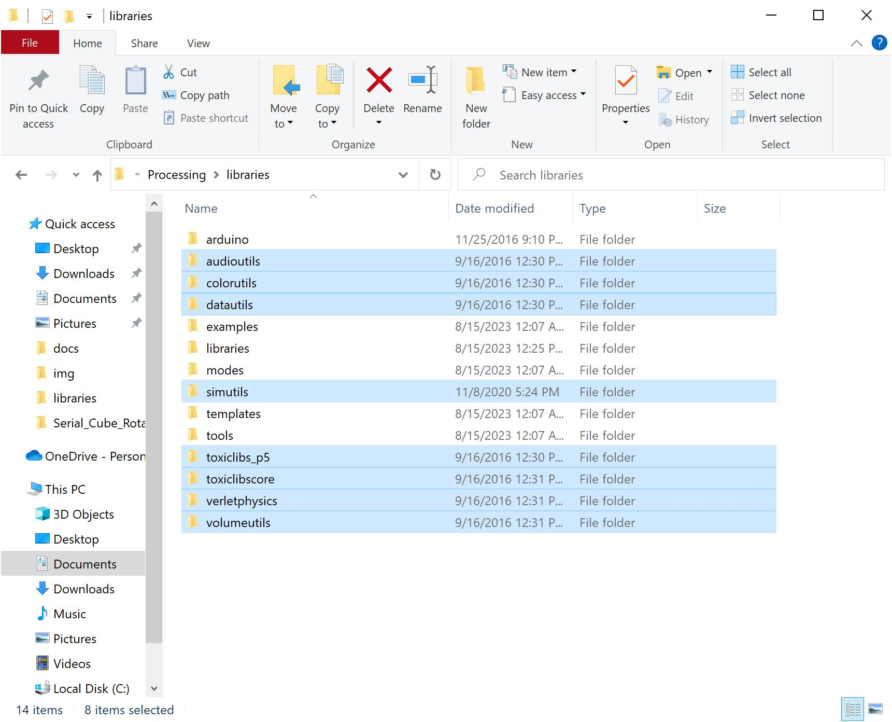

!!!note
    Processing is a software that enables visual representation of data, among other things. If you've never dealt with Processing before, we recommend you also check out the [Arduino to Processing](https://learn.sparkfun.com/tutorials/connecting-arduino-to-processing) tutorial. Follow the below button to download and install Processing.

    
<a href="https://processing.org/download/" target="download_processing_ide" class="md-button">Download Processing IDE</a>

!!!note
    At the time of writing this tutorial, we used Arduino IDE v2.1.1 and SparkFun VR IMU BNO08X Arduino Library v1.0. We also used Processing IDE v3.5.3 and toxiclibs Processing Library v0021. We also tested the demo and verified that it works with Processing v4.3.

### Manually Install the toxiclibs Processing Library v0021

!!!note
    We were unable to search for the **toxiclibs** in Processing's Contribution Manager in order to automatically install the library. Instead, we manually installed the Processing Library.

Before running the "Serial Cube Rotate" processing demo, you will also need to manually install the [ToxicLibs Processing Library v0021](https://github.com/postspectacular/toxiclibs/releases/tag/0021) by "Karsten Schmidt". This is a library used for computational design. Head to the v0021 release and download "**toxiclibs-complete-0021.zip**".

<a href="https://github.com/postspectacular/toxiclibs/releases/tag/0021" target="download_toxiclibs" class="md-button">Download Toxiclibs Processing Library v0021</a>

Similar to an Arduino Library, there is a [certain file structure that Processing requires](https://github.com/processing/processing/wiki/How-to-Install-a-Contributed-Library#manual-install) to properly install a Processing Library. After downloading, unzip the files and open the **toxiclibs-complete-0021** folder. For Windows, copy all the contents of the folder (except for _MACOSX) into the Processing's libraries folder (in this case, **C:\Users\...\Documents\Processing\libraries**). Again, we'll assume that you are using Processing IDE v3.5.3.

  <table>
    <tr style="vertical-align:middle;">
     <td style="text-align: center; vertical-align: middle;"></td>
    </tr>
  </table>

