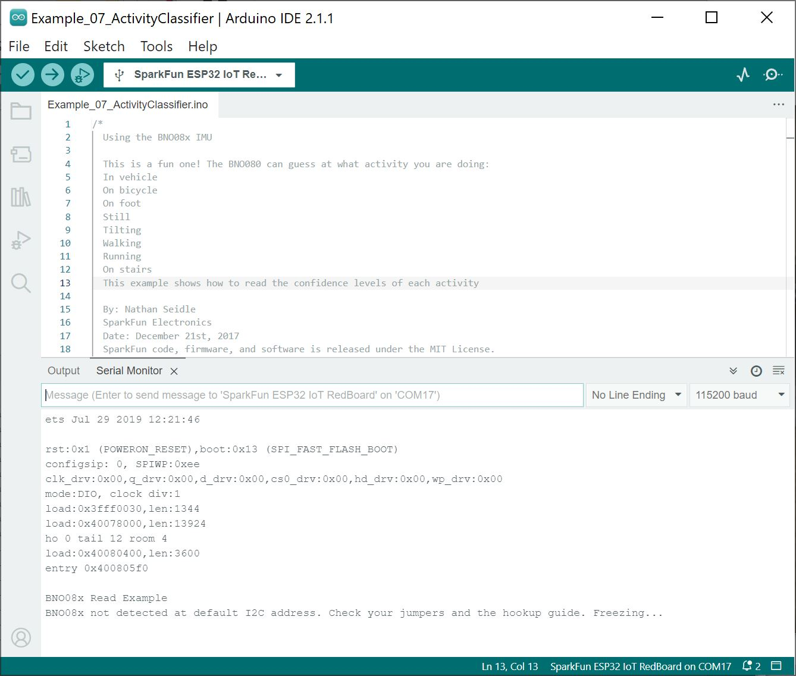

### General Troubleshooting Help

!!! note
    
        <strong> Not working as expected and need help? </strong>   

    If you need technical assistance and more information on a product that is not working as you expected, we recommend heading on over to the <a href="https://www.sparkfun.com/technical_assistance">SparkFun Technical Assistance</a> page for some initial troubleshooting.   

    
<a href="https://www.sparkfun.com/technical_assistance" target="sfe_technical_assistance" class="md-button">SparkFun Technical Assistance Page</a>

    If you don't find what you need there, the <a href="https://forum.sparkfun.com/">SparkFun Forums</a> are a great place to find and ask for help. If this is your first visit, you'll need to <a href="https://forum.sparkfun.com/ucp.php?mode=register">create a Forum Account</a> to search product forums and post questions.  

    
<a href="https://forum.sparkfun.com/ucp.php?mode=register" class="md-button">Create New Forum Account</a>&nbsp;&nbsp;&nbsp;<a href="https://forum.sparkfun.com/viewforum.php?f=180" class="md-button md-button--primary">Log Into SparkFun Forums</a>

If you are having problems connecting to the BNO086 and you see the following output after resetting the RedBoard IoT - ESP32 in the Serial Monitor, there could be a few reasons why.

  <table>
    <tr align="center">
     <td></td>
    </tr>
  </table>

If you are using the I2C examples, try checking your connections and the Qwiic cable for loose connections. Also, ensure that the correct I2C's address jumper is selected as well as the jumpers for the protocol selection. The communication may also be out of sync with the BNO086. You may need to power cycle the board by removing the cable from the connector and reconnecting it.

You may also want to try connecting the interrupt and reset pins to the board for a hardware reset. Make sure to check example 17 for more information about modifying the example to include the hardware reset.
